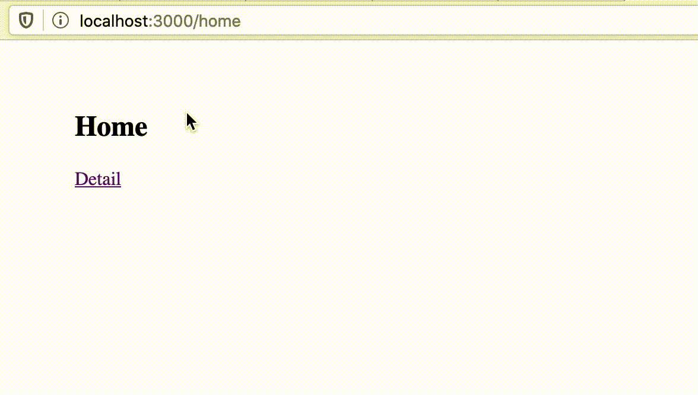

# Webpacker/Turbolinks demo

Project generated using

    rails new loadly -M -C -S -d postgresql --webpacker --no-rc

  * M - Skip action mailer
  * C - Skip Action Cable
  * S - Skip sprockets

## Home Route

Home Controller generated using:

    bin/rails g controller Home --no-helper --no-assets
